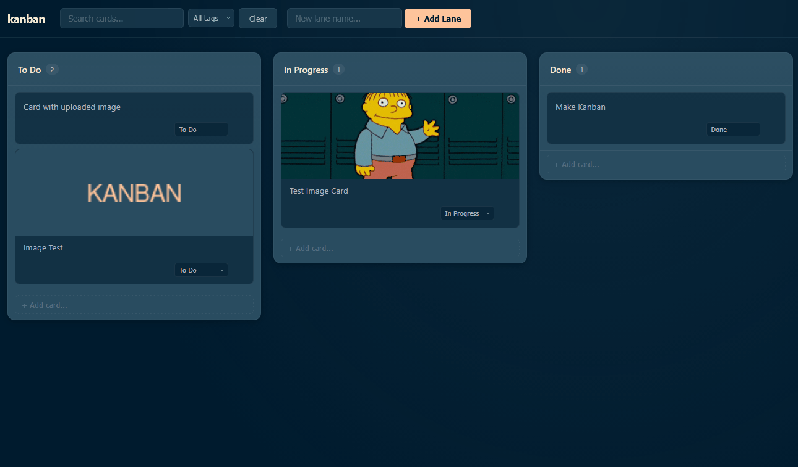

# ds-testing



A single-user Kanban board built from scratch with a Go API backend and HTMX frontend, featuring a dark theme with subtle CSS.

## Features

- Create, edit, and delete cards across multiple lanes
- Tags with color coding
- Due dates with status indicators
- Image attachments (URL paste + file upload)
- Full-text search
- CSS animations for card transitions
- Dark theme with Prussian Blue / Charcoal Blue palette

## Tech Stack

- **Backend:** Go with SQLite
- **Frontend:** HTMX + vanilla CSS
- **Embedded:** templates and static assets via `embed.FS`

## Quick Start

```bash
go run .
# Server starts on http://localhost:8080
```

## Build

```bash
go build -o kanban .
./kanban
```

## Development Prompts & Cost

| # | Prompt | Tokens | Cost | Time |
|---|--------|--------|------|------|
| 1 | Build a basic kanban from scratch: Go API/backend, HTMX frontend with nice subtle CSS with dark theme. Colors: Prussian Blue `#001b2e`, Charcoal Blue `#294c60`, Pale Slate `#adb6c4`, Papaya Whip `#ffefd3`, Peach Glow `#ffc49b`. No auth, single-user tool. | — | — | — |
| 2 | Brainstorm 4-5 new features and add them (tags, assignment, image support, cool CSS animations) | — | — | — |
| 3 | Fix contrast on dropdowns (white on light is hard to read), make cards 40% wider | — | — | — |
| 4 | nice, ok need to debug, i don't see the images after pasting in a link | — | — | — |
| 5 | also need to be able upload images (not just links) | — | — | — |
| 6-10 | ...various image upload/link fixes... | — | — | — |
| 11 | nice, added a .gif here in project base. add to top of readme and move to a good spot in project| — | — | — |
| **Total** | | **~14M tokens** | **$0.23** | **<25 mins** |

## License

MIT © [phiat](https://github.com/phiat)
